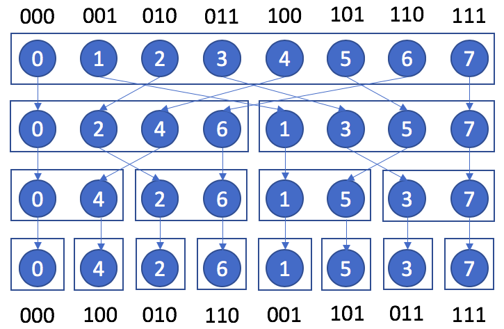
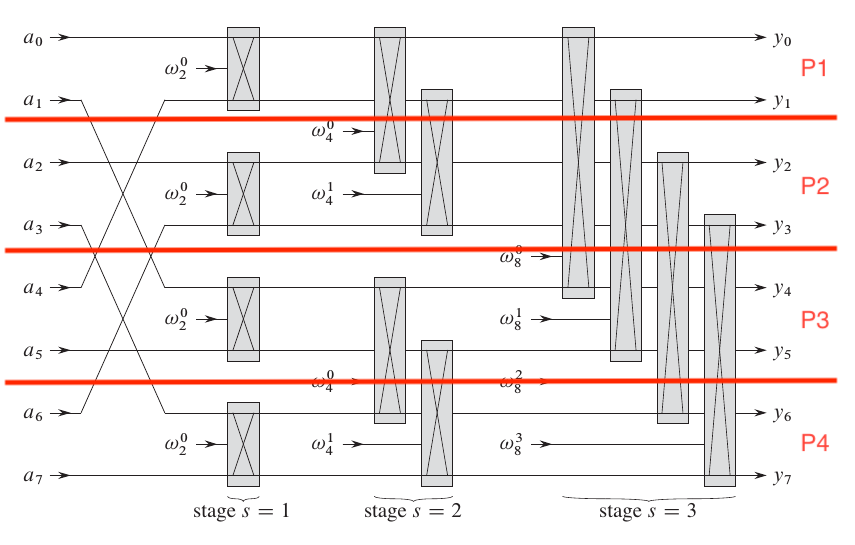
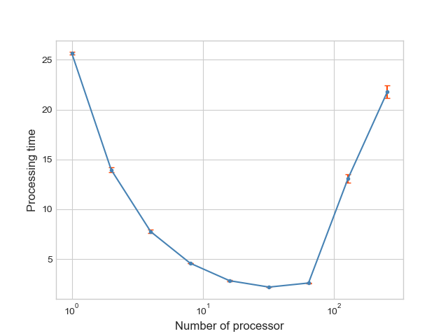

# Fast Fourier Transform 

## Introduction

Fourier transform is a powerful tool used in many fields such as acoustics, electronics, solving differential equation or image analysis... 
In this project, we aim to implement an efficient algorithm to compute a Fourier transform, parallelize it using MPI interface [^1], and run it on KTH multi-nodes clusters (Tegner)

## Algorithms 

### Fourier Transform 
The Fourier transform of a sequence of $N$ points $(x_n)_{n \in \{0,\cdots, N-1\}}$ can be expressed as another sequence of N points $\mathcal{F}(x)$:
$$\forall k \in \{1,\cdots, N\},{\mathcal{F}(x)_k} = \sum _{n=0}^{N-1} {x_n} e^{-i\frac{2 k n \pi}N }$$

Consequently our algorithm should take as an input an array of points $x$ and return as an output an array of same size $X$ which contain the transformed values. A naive approach is to loop over $k$ and compute the value of $\mathcal{F}(x)_k$ as the sum described in the equation. The complexity of such an algorithm is in $O(N^2)$. It has been implemented in `1.fourier_transform.c`

This algorithm is embarrassingly parallelizable as each element $\mathcal{F}(x)_k$ can be computed independently: no communication and if $P$ is the number of processors, a complexity in $O(N^2/P)$ can be easily obtained. It should be pointed out that such a parallelization has a memory cost: the $x$ values should be replicated on each processor.

### Cooley-Tukey Algorithm
We will then focus on a more efficient method of computing the Fourier transform, in the case $N$ is a power of 2 [^2]. This method is based on a division of previous equation into two parts, a sum over values with even indices and a sum over values with odd indices : 

$${\mathcal{F}(x) _k} = {\mathcal{F}({x _{even}})_k} + e^{-i\frac{k\pi}{N/2}} \cdot {\mathcal{F}({x _{odd}})_k}$$

$${\mathcal{F}(x) _{k + N/2}} = {\mathcal{F}({x _{even}})_k} - e^{-i\frac{k\pi}{N/2}} \cdot F{({x _{odd}}) _k}$$

From these equation, a recursive algorithm can be derived, it is implemented in `2.fft_recursive`

This algorithm has a time complexity of $O(N\log N)$.

### Iterative Cooley-Tukey Algorithm
To parallelize this algorithm, it is easier to start from an iterative algorithm. Thus, we transformed previous algorithm into an iterative version. To do so, let's observe the structure of this algorithm. For 8 elements, it can schematized as the following image: 

 

We can notice that at the bottom of the tree, at the first step of the algorithm, we start with an array of values re-ordered so each cell contains the value of the binary inverse indice. Then at each step, we combine 2 sets of $2^i$  values to computes the fourier transform of the $2^{i+1}$ values above. The iterative version of this algorithm is implemented in `3.fft_recursive`

### Parallel Algorithm

Parallelizing implies the communication of the intermediate results between processors. However, computations can be organised as the following schema [^3]:

 

This has two advantages : 
- First, there are $\log(N)$ steps, this organisation only requires communication in the last $\log(P)$ steps. 
- Then at each step, each processor only requires intermediate results from one other processor, which can be achieved much faster than a "all to all" communication: 

The algorithm has been implemented in `4.fft_parallel.c`

For the parallel version, the time can be divided between computation and communication : 
- The exchange of intermediate results between processors is done in the last $\log P$ steps of the algorithm. Each time, two processors exchange $N/P$ elements. Consequently, the communication time is
$$t_{comm} = 2 \log P \cdot (t_{startup} + \frac{N}{P}t_{data})$$

- There are $\log N$ computation steps. each time, processors need to compute $N/P$ values. So 
$$t_{comp}= \log N \cdot \frac{N}{P} t_a$$
Thus, the parallelized algorithm has a complexity of $O((\log N + \log P) \cdot \frac{N}{P})$, and for large values of N, the speed up is in $O(P)$ 

## Experiments 
For several sizes of input, we run 5 experiments and save the time to complete the algorithm

1. Compile file : `mpicc -o fft 4.fft_parallel.c` (you must have open-mpi installed)
2. Send `fft` executable and `run_experiment.sh` to cluster 
3. Run `./run_experiment.sh` in cluster

The time are displayed in the following figure:

 

Speed up is nearly linear until 32 processors, after which, communication becomes longer than computation.

[^1]: Michael J. Quinn. *Parallel Programming in C with MPI and openMP.* Oregon State University, 2003.

[^2]: Barry Wilkinson and Michael Allen. *Parallel Programming: Techniques and Applications Using Net-
worked Workstations and Parallel Computers (2Nd Edition)*. Upper Saddle River, NJ, USA: Prentice-
Hall, Inc., 2004. isbn: 0131405632

[^3]: Thomas H. Cormen et al. *Introduction to Algorithms, Third Edition.* 3rd. The MIT Press, 2009